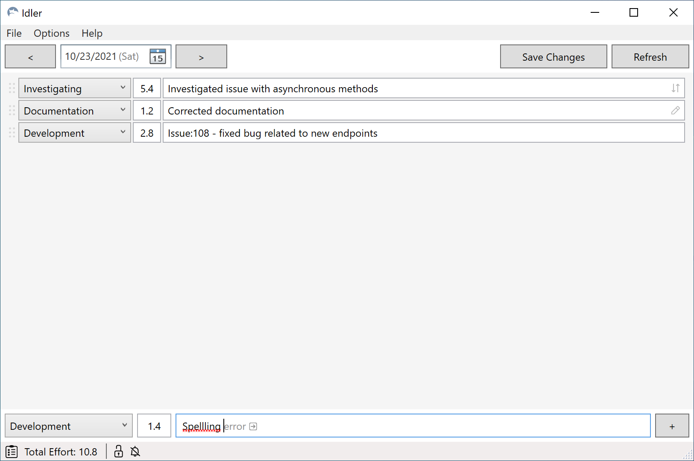
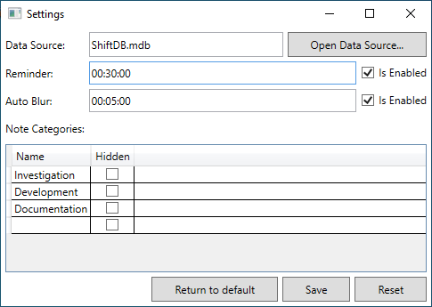

# Idler

> Note, that the application is under active developing so some features can work incorrectly

The application helps you to track your work activity. It stores the activity in local file `Microsoft Access Database` in its folder by default.

## Pre-requirements

The program relies on `Microsoft Access Database Engine 2010 Redistributable` so you need to download and install it before using the application. Please refer the page: https://www.microsoft.com/en-us/download/details.aspx?id=13255

## Basics

### DataBase file

When you launch the program in first time, it creates new DataBase file in its folder. The file has format `Microsoft Access Database` so you can open it with `Microsoft Access` and make some manual changes or you can create some queries or whatever you need and it will be kept in the file and won't be removed by the `Idler`. You can moved the file in place you need and specify new path in settings.

### Shift

Main concept of the applicaiton is a `shift`. `Shift` is a container for `notes`. You can create new shift by pressing `plus` button at the top-right, it appears when you are on last shift. Button can be disabled, it means there are not saved changes or there is some ongoing process. To delete shift you can press button `Remove Shift`

### Notes

Note represents a single activity. It contains follow properties:

- Category
- Effort
- Description
- Start Time

You can add new note by controls located at the bottom of the main window. Once you finish to fill all fields just hit `Enter` or press on button `+` and the note will be added to a shift.

When you added notes you want, don't forget to press button `Save Changes` (Ctrl+S) to save all notes to DataBase file. All unsaved notes are marked yellow. To refresh list notes for current shift you can press button `Refresh`.

> Note, that button `Refresh` removes all unsaved changes!

And at last, you can find counter which shows you total effort of current shift at bottom left of main window.

### Settings

In settings you can:

- specify path to DataBase file
- change DataProvider name (not recommended)
- enable/disable reminders
- set reminders interval
- manage `Note Categories`

#### Reminders

You can enable reminders. This feature helps you to not forget to fill your work progress. Reminder represents Windows Toast notification which is shown up in right bottom corner in according with interval specified in settings.
